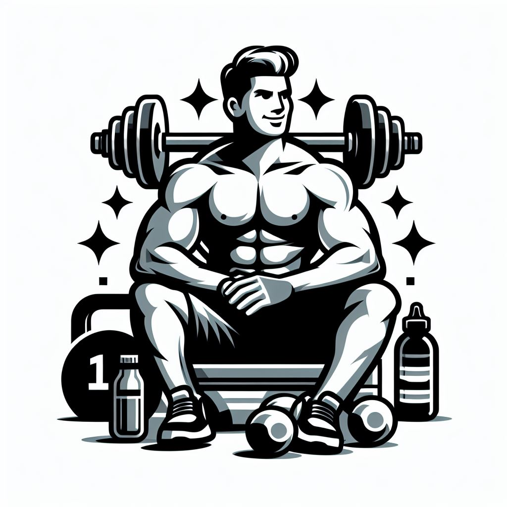

# GymGenius
Bienvenue sur GymGenius, votre compagnon ultime pour la création de séances de sport personnalisées ! Cette application WPF vous permet de concevoir des séances d'entraînement adaptées à vos besoins, que vous soyez débutant ou expert en fitness. Avec GymGenius, la planification de vos sessions de gym n'a jamais été aussi simple et efficace.

## 🎯 Tester GymGenius
### Prérequis
- **Windows**
### 🟢 Méthode sans installation (recommandé)
1. **Rendez vous sur la page suivante :**
  https://github.com/AlexNbl27/GymGenius/releases/tag/NOinstall

2. **Cliquer sur le dossier ZIP NoInstallWindows.zip pour le télécharger**
3. **Rendez-vous dans téléchargements de votre ordinateur et dézipper le dossier (extraire tout)**
4. **Une fois le dossier extrait, ouvrez le**
  Vous devriez y voir cinq fichiers à l'intérieur
5. **Cliquez deux fois sur GymGenius pour lancer l'application (le fichier avec l'icône)**
  Si jamais une popup windows apparaît pour vous dire que ce fichier peut-être dangereux, confirmez en cliquant sur "Exécuter quand même"

**Et voilà ! GymGenius est à vous ! 🥳**

### 🟠 Méthode avec installation
1. **Rendez vous sur la page suivante :
  https://github.com/AlexNbl27/GymGenius/releases/tag/install

2. **Cliquer sur le dossier ZIP InstallWindows.zip pour le télécharger**
3. **Rendez-vous dans téléchargements de votre ordinateur et dézipper le dossier (extraire tout)**
4. **Une fois le dossier extrait, ouvrez le**
  Vous devriez y voir deux fichiers et un dossier à l'intérieur
5. **Cliquez deux fois sur GymGenius pour installer l'application**
  Une popup va apparaître et vous signaler que l'éditeur ne peut pas être vérifié. Confirmez en cliquant sur installer.

**Et voilà ! GymGenius est à vous ! 🥳**

6. Pour désinstaller l'application, faites comme vous le faites pour toute les autres application.
  Menu Windows --> GymGenius --> Clic droit --> Désinstaller

## ✨ Fonctionnalités
Découvrez les fonctionnalités puissantes de GymGenius, conçues pour simplifier la création de vos séances d'entraînement. Explorez un ensemble complet d'outils qui vous permettront de personnaliser, planifier et suivre vos séances de sport de manière efficace et motivante :

- Accès à une liste d'exercices avec différentes difficultés, différents matériels, dans différentes configurations.
- Une option de filtrage utile pour trouver des exercices spécifiques à une partie du corps et adaptés à votre expérience.
- Des paramètres sympas pour personnaliser votre séance.
- Possibilité de sauvegarder sa séance dans son calendrier via le format ICS et de pouvoir à tout moment la réimporter dans l'application GymGenius.
- Possibilité de réaliser la séance directement sur l'application une fois créée ou lorsque qu'on l'importe.

## 👨‍💻 Méthode de développement
### Organisation des dossiers et des fichiers
Nous avons utilisé la structure de développement **MVVM** (Modèle Vue Vue-Modèle) pour ce projet. 
  Ainsi, nous avons décomposé nos fichiers tels que :
- **Models** : Le dossier *Models* regroupe l'ensemble des fichiers nous ayant permis de mettre en œuvre la programmation orientée objet (POO). On y retrouve notamment les classes abstraites et leurs enfants, la gestion de la machine à états ou encore la classe permettant de créer une séance de sport.
- **Views** : Le dossier *Views* regroupe toutes nos pages WPF et le code XAML qui leur est associé. La partie logique de ces fichiers a été séparée autant que possible pour assurer une maintenabilité optimale du code.
- **ViewModel** : Le dossier *ViewModel* regroupe tous les fichiers permettant de faire le lien entre nos classes du dossier Models et nos pages du dossier Views.

En plus de cela, d'autres dossiers viennent compléter ce trio pour permettre une compréhension du code simplifiée :
- **Controllers** : Le dossier *Controllers* regroupe tous les fichiers permettant une refactorisation maximale des autres fichiers. Nous retrouvons ainsi toutes les classes qui seront utilisées à plusieurs endroits dans le code comme, par exemple, *TimeController* qui permet de gérer efficacement l'affichage du temps (heures, minutes, secondes) ou encore *TimerController* qui permet de gérer efficacement l'utilisation des minuteurs.
- **Utils** : Le dossier *Utils* regroupe tous les fichiers annexes utiles au projet. C'est d'ailleurs dans ce dossier que se trouve le code qui permet l'export et l'import de notre séance au format ICS.
- **Assets** : Ce dossier contient les ressources du projet.

### Design Patterns
Nous avons utilisé 4 design patterns communs pour créer notre application :
- Le design **States** : Nous avons utilisé une machine à états pour gérer le déroulement d'une séance de sport. Les deux états sont Exercice et Repos et s'alternent dans une combinaison logique d'appels de fonctions.
- Le design **Observer** : Combiné à la machine à états, nous avons utilisé un système d'abonnement pour permettre l'itération de notre liste d'exercices en fonction de l'index actuel à chaque fois qu'on entre dans l'état Exercice.
- Le design **Abstract Factory** : Puisque ce projet était prévu pour nous faire progresser sur le polymorphisme, nous avons décidé de créer une base de données d'exercices en dur plutôt qu'une base de données externe au projet. Ainsi, nous avons créé une classe abstraite AExercise dont découlent ensuite tous nos exercices. À cela s'ajoute également une interface ISerie pour différencier les exercices qui se font en séries (ex. : les pompes) de ceux qui se font sur la durée (ex. : le gainage).
- Le design **Bridge** : Chaque exercice est associé à une liste de muscles qu'il fait travailler. Or, nous voulions filtrer nos exercices par partie du corps travaillée. Ainsi, chaque muscle (*AMuscle*) est lui-même associé à une partie du corps (*ABodyPart*).

## Auteurs

- [@AlexNbl27](https://github.com/AlexNbl27)
- [@AlexandreBudan](https://github.com/AlexandreBudan)
- [@manonbrz](https://github.com/manonbrz)
